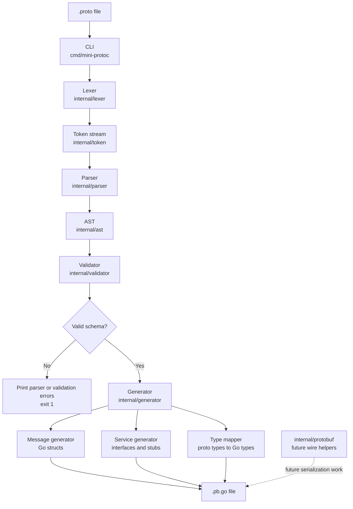

# mini-protoc

`mini-protoc` is a small Protocol Buffers compiler written in Go. It reads a focused subset of `.proto` files, builds an internal AST, validates the schema, and generates Go code containing message structs plus lightweight service/client stubs.

The project is intentionally compact. Its current scope is best understood as a learning-oriented compiler pipeline for proto-like schemas, not a replacement for the official `protoc` compiler.

## Current Capabilities

- Parses `proto3` syntax declarations.
- Parses dot-separated package names.
- Parses message declarations with numbered fields.
- Parses unary service RPC declarations.
- Supports `//` line comments in input files.
- Validates duplicate messages, fields, services, and RPC names.
- Validates duplicate field numbers.
- Validates primitive and message-referenced field types.
- Generates Go package declarations, structs, service interfaces, client constructors, client method stubs, and registration stubs.

## Supported Proto Subset

The parser currently supports files shaped like this:

```proto
syntax = "proto3";

package user;

message UserRequest {
    string name = 1;
    int32 age = 2;
}

message UserResponse {
    string name = 1;
    int32 age = 2;
}

service UserService {
    rpc GetUser(UserRequest) returns (UserResponse);
    rpc CreateUser(UserRequest) returns (UserResponse);
}
```

Supported primitive field types:

| Proto type | Generated Go type |
| --- | --- |
| `string` | `string` |
| `int32` | `int32` |
| `int64` | `int64` |
| `bool` | `bool` |
| `float` | `float32` |
| `double` | `float64` |

Message types can also be used as field types when the referenced message exists in the same parsed file.

## Generated Output

Running the compiler against `examples/user.proto` generates `examples/user.pb.go`:

```go
package user

type UserRequest struct {
	Name string
	Age int32
}

type UserResponse struct {
	Name string
	Age int32
}

type UserService interface {
	GetUser(req UserRequest) (UserResponse, error)
	CreateUser(req UserRequest) (UserResponse, error)
}

type UserServiceClient struct {
}

func NewUserServiceClient() *UserServiceClient {
	return &UserServiceClient{}
}

func (c *UserServiceClient) GetUser(req UserRequest) (UserResponse, error) {
	panic("not implemented")
}

func (c *UserServiceClient) CreateUser(req UserRequest) (UserResponse, error) {
	panic("not implemented")
}

func RegisterUserService(service UserService) {
	panic("not implemented")
}
```

### Generated Artifacts

- Message structs represent parsed proto messages as exported Go structs.
- The service interface describes the server-side contract that an implementation must satisfy.
- The client stub provides a generated `<ServiceName>Client` type, constructor, and RPC method names matching the service definition.
- The registration stub provides a generated `Register<ServiceName>()` entry point for wiring a service implementation into a runtime.

Generated client RPC methods and registration functions are currently placeholders. They call `panic("not implemented")` and are intended to be connected to a future mini-rpc runtime rather than performing real RPC behavior today.

## Architecture



## Pipeline

1. `cmd/mini-protoc/main.go` receives a `.proto` file path.
2. The CLI reads the file contents.
3. `internal/lexer` converts source text into tokens.
4. `internal/parser` consumes tokens and builds `internal/ast.ProtoFile`.
5. `internal/validator` checks syntax version, package presence, duplicate declarations, field numbering, and type references.
6. `internal/generator` writes generated Go source into a string builder.
7. The CLI writes the result next to the input file using the `.pb.go` suffix.

## Project Layout

```text
cmd/mini-protoc/              CLI entry point
examples/                     Example proto input and generated Go output
internal/ast/                 AST node definitions
internal/generator/           Go code generation for packages, messages, services, and types
internal/lexer/               Character scanner and tokenization
internal/parser/              Recursive parser for the supported proto subset
internal/protobuf/            Placeholder package for future wire encoding/decoding work
internal/token/               Token definitions and keyword lookup
internal/validator/           Semantic validation for parsed proto files
```

## Usage

Run the compiler with a `.proto` file:

```sh
go run ./cmd/mini-protoc examples/user.proto
```

Expected output:

```text
generated examples/user.pb.go
```

The output path is derived from the input path by replacing the `.proto` suffix with `.pb.go`.

## Testing

Run all tests:

```sh
go test ./...
```

Current tests cover:

- Lexer token output for syntax, packages, messages, fields, comments, and services.
- Parser behavior for syntax declarations, packages, messages, services, and complete files.
- Validator behavior for valid files, duplicate names/numbers, missing values, unsupported field types, and unknown RPC request/response types.

## Validation Rules

A valid file must:

- Use `syntax = "proto3";`.
- Declare a package.
- Avoid duplicate message names.
- Avoid duplicate service names.
- Avoid duplicate field names within a message.
- Avoid duplicate field numbers within a message.
- Use positive field numbers.
- Use supported primitive field types or known message types.
- Use known message types for RPC request and response types.
- Avoid duplicate RPC names within the same service.

## Current Limitations

The following common protobuf features are outside the current project scope:

- Imports.
- Enums.
- Repeated fields.
- Maps.
- `oneof`.
- Field options.
- Reserved fields.
- Nested messages.
- Streaming RPCs.
- Package-to-directory mapping.
- Go struct tags.
- Generated marshal/unmarshal methods.
- Generated service stubs do not yet perform network transport, service registration, serialization, or RPC dispatch.
- Real RPC transport/client/server runtime behavior.

`internal/protobuf` and `internal/generator/serializer_generator.go` are currently scaffolding for future serialization work.

## Development Notes

The codebase follows a simple compiler-style separation:

- Keep lexical rules in `internal/lexer`.
- Keep grammar construction in `internal/parser`.
- Keep semantic correctness checks in `internal/validator`.
- Keep emitted Go source decisions in `internal/generator`.

When extending the supported proto subset, update the lexer tokens first, then the AST, parser, validator, generator, and tests in that order.
